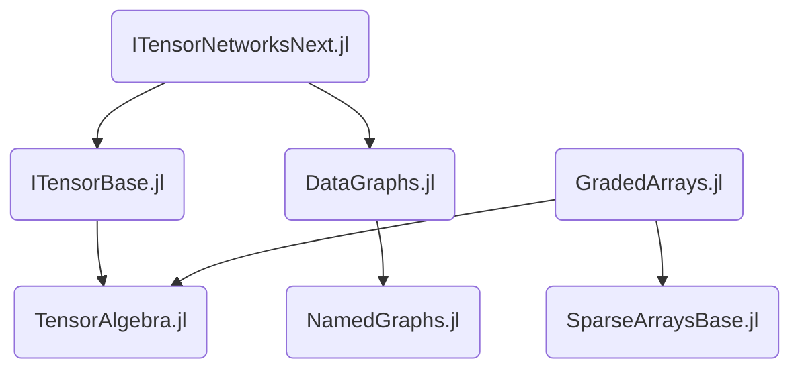

# ITensor Ecosystem Overview

```mermaid
graph TD
    ITensorNetworksNext(ITensorNetworksNext.jl) --> ITensorBase(ITensorBase.jl)
    ITensorNetworksNext --> DataGraphs(DataGraphs.jl)
    DataGraphs --> NamedGraphs(NamedGraphs.jl)
    ITensorBase --> TensorAlgebra(TensorAlgebra.jl)
    GradedArrays(GradedArrays.jl) --> TensorAlgebra
    GradedArrays --> SparseArraysBase(SparseArraysBase.jl)
```
