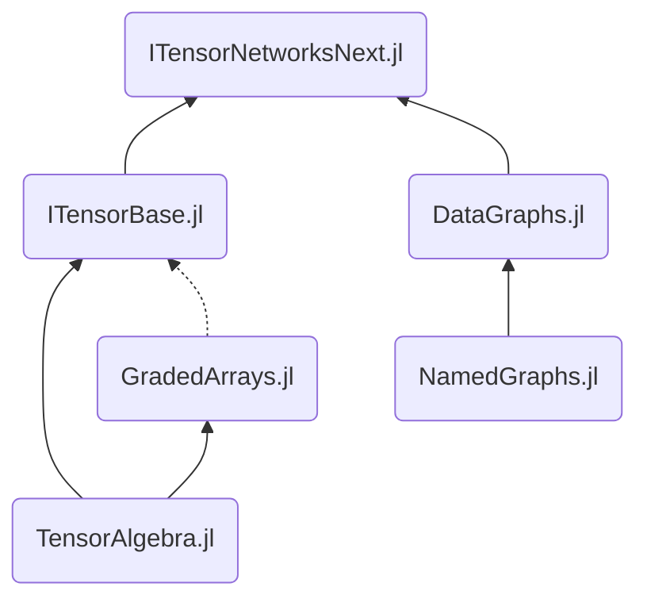

# ITensor Ecosystem Overview

The dotted arrow is an optional dependency, loaded through a package extension.

```mermaid
graph BT
    ITensorBase(ITensorBase.jl) --> ITensorNetworksNext(ITensorNetworksNext.jl)
    DataGraphs(DataGraphs.jl) --> ITensorNetworksNext
    NamedGraphs(NamedGraphs.jl) --> DataGraphs
    TensorAlgebra(TensorAlgebra.jl) --> ITensorBase
    TensorAlgebra --> GradedArrays(GradedArrays.jl)
    GradedArrays -.-> ITensorBase
```
