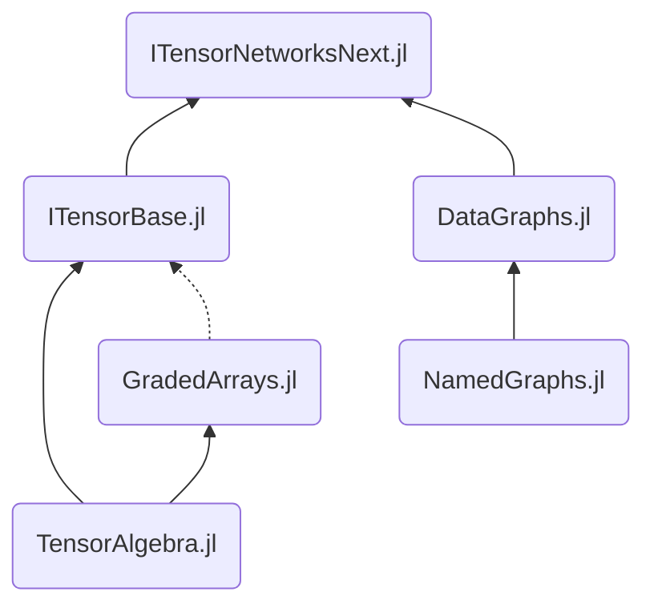

# ITensor Ecosystem Overview

```mermaid
graph BT
    ITensorBase(ITensorBase.jl) --> ITensorNetworksNext(ITensorNetworksNext.jl)
    DataGraphs(DataGraphs.jl) --> ITensorNetworksNext
    NamedGraphs(NamedGraphs.jl) --> DataGraphs
    TensorAlgebra(TensorAlgebra.jl) --> ITensorBase
    TensorAlgebra --> GradedArrays(GradedArrays.jl)
    GradedArrays -.-> ITensorBase
```

Arrows point from a package to the packages that depend on it. Dotted arrows are weak dependencies, loaded through package extensions.
